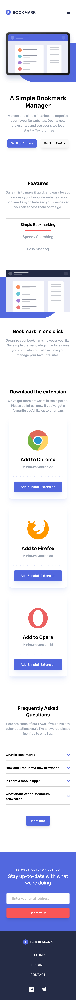
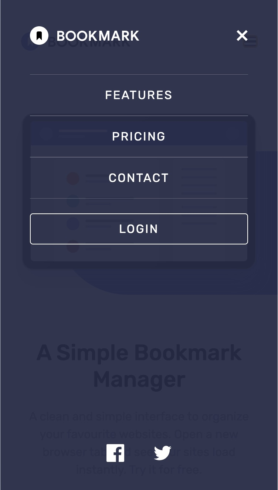
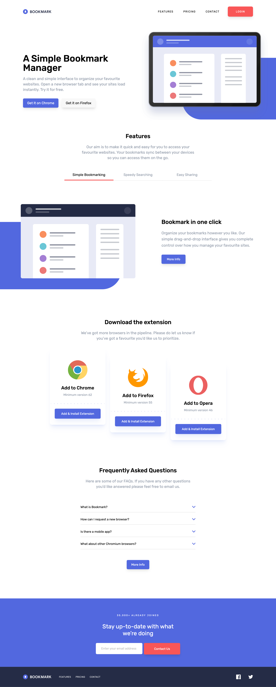
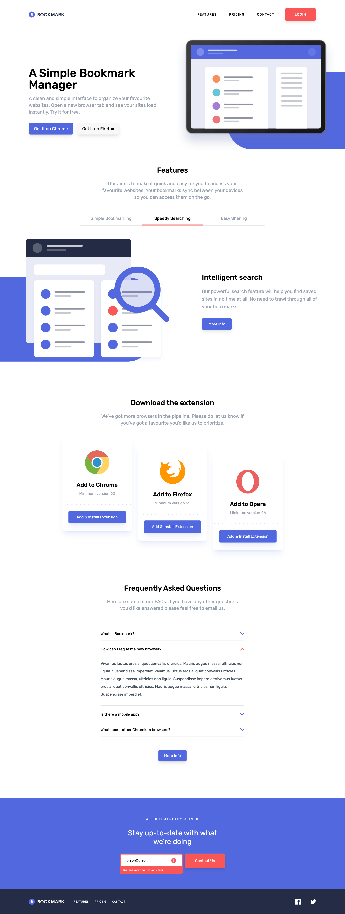

# Frontend Mentor - Bookmark landing page solution

This is a solution to the [Bookmark landing page challenge on Frontend Mentor](https://www.frontendmentor.io/challenges/bookmark-landing-page-5d0b588a9edda32581d29158). Frontend Mentor challenges help you improve your coding skills by building realistic projects. 

## Table of contents

- [Overview](#overview)
  - [The challenge](#the-challenge)
  - [Screenshot](#screenshot)
  - [Links](#links)
- [My process](#my-process)
  - [Built with](#built-with)
  - [What I learned](#what-i-learned)
  - [Continued development](#continued-development)
  - [Useful resources](#useful-resources)

## Overview

### The challenge

Users should be able to:

- View the optimal layout for the site depending on their device's screen size
- See hover states for all interactive elements on the page
- Receive an error message when the newsletter form is submitted if:
  - The input field is empty
  - The email address is not formatted correctly

### Screenshot






### Links

- Solution URL: [Add solution URL here](https://your-solution-url.com)
- Live Site URL: [Add live site URL here](https://your-live-site-url.com)

## My process

### Built with

- Semantic HTML5 markup
- CSS custom properties
- Flexbox
- Mobile-first workflow
- Tailwind CSS

### What I learned

I learned how to use Tailwind CSS without relying on other frameworks, which required some research to set up. Additionally, creating tabs was my first experience, so it was a great opportunity for me.

```html
<ul class="..." role="tablist">
  <li class="...">
    <button class="... active" data-tab="bookmarking" type="button" role="tab" aria-controls="bookmarking" aria-selected="false" class="...">Simple Bookmarking</button>
  </li>
  ...

  <article id="tab-bookmarking" class="... active" role="tabpanel" aria-hidden="false">
    <div class="...">
      
    </div>
    <div class="...">
      <h3 class="...">Bookmark in one click</h3>
      <p class="...">
        Organize your bookmarks however you like. Our simple drag-and-drop interface 
        gives you complete control over how you manage your favourite sites.
      </p>
      <button aria-label="More info" class="...">More Info</button>
    </div>
  </article>
```

```js
tabButtons.forEach((button) => {
  button.addEventListener('click', () => {
    tabButtons.forEach((tabButton) => tabButton.classList.remove('active'));
    tabPanels.forEach((tabPanel) => tabPanel.classList.remove('active'));
    button.classList.add('active');
    const tabId = button.getAttribute('data-tab');
    document.getElementById(`tab-${tabId}`).classList.add('active');
  })
});
```

### Continued development

I plan to continue learning Tailwind CSS, exploring more features, including advanced functionalities and animations.

### Useful resources

- [Tailwind CSS](https://tailwindcss.com/docs/theme) - This helped me to write the theme.
- [Stack Overflow](https://stackoverflow.com/questions/79380514/problem-installing-tailwindcss-with-vite-after-npx-tailwindcss-init-p-comman) - This helped me intall with Vite.
# bookmark-landing-page-master
